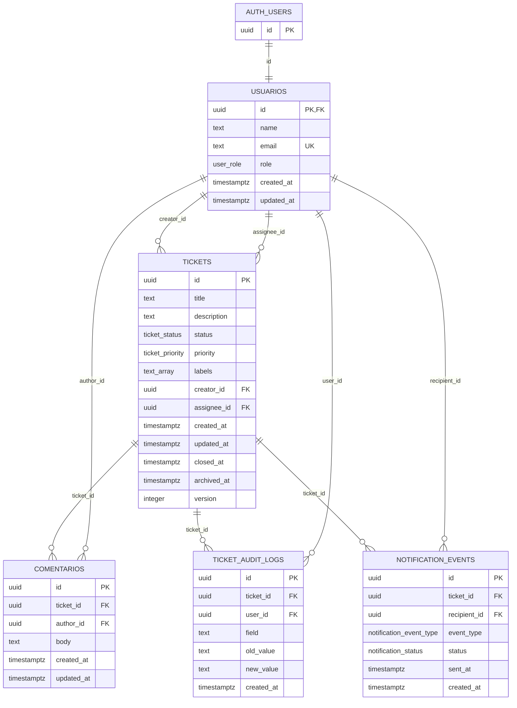

# Base de Datos - Mini Jira

Fuente usada: `frontend/docs/init_db.sql`.

No se encontro `src/db/schema.ts` de Drizzle ni migraciones en `src/db/migrations/`. Este documento se genero desde el SQL disponible.

## ERD

## Tablas y columnas clave

| Tabla | Columnas clave | Tipo | Constraints |
| --- | --- | --- | --- |
| `auth.users` | `id` | `uuid` | PK externa gestionada por Supabase Auth |
| `public.usuarios` | `id` | `uuid` | PK, FK a `auth.users(id)`, `ON DELETE CASCADE`, NOT NULL |
| `public.usuarios` | `name` | `text` | NOT NULL |
| `public.usuarios` | `email` | `text` | NOT NULL, UNIQUE |
| `public.usuarios` | `role` | `public.user_role` | NOT NULL, default `'user'` |
| `public.usuarios` | `created_at`, `updated_at` | `timestamptz` | NOT NULL, default `now()` |
| `public.tickets` | `id` | `uuid` | PK, default `gen_random_uuid()` |
| `public.tickets` | `title` | `text` | NOT NULL, CHECK `length(trim(title)) > 0` |
| `public.tickets` | `description` | `text` | Nullable |
| `public.tickets` | `status` | `public.ticket_status` | NOT NULL, default `'todo'`, CHECK de consistencia con `archived_at` y `closed_at` |
| `public.tickets` | `priority` | `public.ticket_priority` | NOT NULL, default `'medium'` |
| `public.tickets` | `labels` | `text[]` | NOT NULL, default `'{}'` |
| `public.tickets` | `creator_id` | `uuid` | NOT NULL, FK a `public.usuarios(id)`, `ON DELETE RESTRICT` |
| `public.tickets` | `assignee_id` | `uuid` | FK a `public.usuarios(id)`, `ON DELETE SET NULL` |
| `public.tickets` | `created_at`, `updated_at` | `timestamptz` | NOT NULL, default `now()` |
| `public.tickets` | `closed_at`, `archived_at` | `timestamptz` | Nullable |
| `public.tickets` | `version` | `integer` | NOT NULL, default `1`, incrementado por trigger `trg_tickets_increment_version` |
| `public.comentarios` | `id` | `uuid` | PK, default `gen_random_uuid()` |
| `public.comentarios` | `ticket_id` | `uuid` | NOT NULL, FK a `public.tickets(id)`, `ON DELETE CASCADE` |
| `public.comentarios` | `author_id` | `uuid` | NOT NULL, FK a `public.usuarios(id)`, `ON DELETE RESTRICT` |
| `public.comentarios` | `body` | `text` | NOT NULL, CHECK `length(trim(body)) > 0` |
| `public.comentarios` | `created_at`, `updated_at` | `timestamptz` | NOT NULL, default `now()` |
| `public.ticket_audit_logs` | `id` | `uuid` | PK, default `gen_random_uuid()` |
| `public.ticket_audit_logs` | `ticket_id` | `uuid` | NOT NULL, FK a `public.tickets(id)`, `ON DELETE CASCADE` |
| `public.ticket_audit_logs` | `user_id` | `uuid` | FK a `public.usuarios(id)`, `ON DELETE SET NULL` |
| `public.ticket_audit_logs` | `field` | `text` | NOT NULL |
| `public.ticket_audit_logs` | `old_value`, `new_value` | `text` | Nullable |
| `public.ticket_audit_logs` | `created_at` | `timestamptz` | NOT NULL, default `now()` |
| `public.notification_events` | `id` | `uuid` | PK, default `gen_random_uuid()` |
| `public.notification_events` | `ticket_id` | `uuid` | FK a `public.tickets(id)`, `ON DELETE CASCADE` |
| `public.notification_events` | `recipient_id` | `uuid` | NOT NULL, FK a `public.usuarios(id)`, `ON DELETE CASCADE` |
| `public.notification_events` | `event_type` | `public.notification_event_type` | NOT NULL |
| `public.notification_events` | `status` | `public.notification_status` | NOT NULL, default `'pending'` |
| `public.notification_events` | `sent_at` | `timestamptz` | Nullable |
| `public.notification_events` | `created_at` | `timestamptz` | NOT NULL, default `now()` |
| `public.notification_events` | `ticket_id`, `recipient_id`, `event_type` | compuesto | UNIQUE `notification_events_unique_event` |

## Enums

| Enum | Valores |
| --- | --- |
| `public.user_role` | `admin`, `user` |
| `public.ticket_status` | `todo`, `in_progress`, `review`, `blocked`, `done`, `archived` |
| `public.ticket_priority` | `low`, `medium`, `high`, `critical` |
| `public.notification_event_type` | `ticket_assigned`, `user_mentioned`, `ticket_blocked` |
| `public.notification_status` | `pending`, `sent`, `failed` |

## Decisiones de diseno

### Soft delete via `archived_at`

`public.tickets` usa `archived_at` como marca de archivado logico. El SQL documenta que no se define `DELETE` para tickets y que la accion visual "Eliminar" debe actualizar `status = 'archived'` y `archived_at = now()`.

La consistencia se refuerza con `tickets_archived_consistency`: si `status = 'archived'`, `archived_at` debe existir. Las politicas RLS de update tambien bloquean cambios sobre tickets archivados usando `archived_at is null`.

### Pessimistic Lock (`ticket_locks`)

`frontend/docs/init_db.sql` no define una tabla `ticket_locks`. Por tanto, el esquema disponible no materializa Pessimistic Lock en base de datos y queda documentado como pendiente.

### AuditLog inmutable

`public.ticket_audit_logs` registra cambios por ticket con `field`, `old_value`, `new_value`, `user_id` y `created_at`.

El SQL solo define politicas RLS para `SELECT` e `INSERT` en auditoria. No define politicas de `UPDATE` ni `DELETE`, y deja el comentario explicito: "No update/delete para auditoria. Los logs deben ser inmutables desde la aplicacion."

## Triggers e indices relevantes

- `public.set_updated_at()`: actualiza `updated_at` antes de updates en `usuarios`, `tickets` y `comentarios`.
- `public.increment_ticket_version()`: incrementa `tickets.version` y refresca `updated_at` antes de cada update.
- Indices principales:
  - `idx_tickets_status`
  - `idx_tickets_priority`
  - `idx_tickets_creator_id`
  - `idx_tickets_assignee_id`
  - `idx_tickets_created_at`
  - `idx_tickets_closed_at`
  - `idx_tickets_archived_at`
  - `idx_tickets_labels` usando GIN
  - indices por FK y fecha en `comentarios`, `ticket_audit_logs` y `notification_events`
