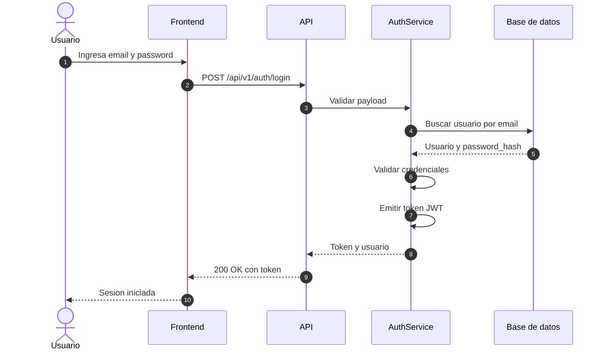
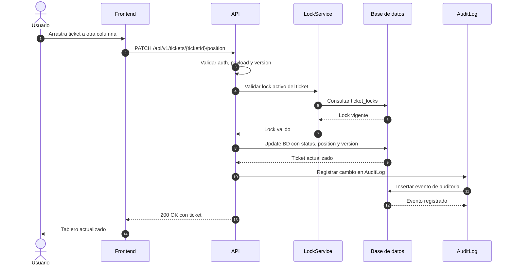
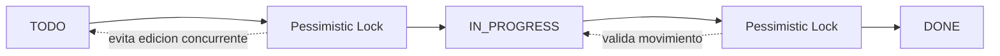

# Diagramas

## Autenticacion JWT

```mermaid
sequenceDiagram
  autonumber
  actor Usuario
  participant Frontend
  participant API
  participant AuthService
  participant DB as Base de datos

  Usuario->>Frontend: Ingresa email y password
  Frontend->>API: POST /api/v1/auth/login
  API->>AuthService: Validar payload
  AuthService->>DB: Buscar usuario por email
  DB-->>AuthService: Usuario y password_hash
  AuthService->>AuthService: Validar credenciales
  AuthService->>AuthService: Emitir token JWT
  AuthService-->>API: Token y usuario
  API-->>Frontend: 200 OK con token
  Frontend-->>Usuario: Sesion iniciada
```

## Mover Ticket Entre Columnas

```mermaid
sequenceDiagram
  autonumber
  actor Usuario
  participant Frontend
  participant API
  participant LockService
  participant DB as Base de datos
  participant AuditLog

  Usuario->>Frontend: Arrastra ticket a otra columna
  Frontend->>API: PATCH /api/v1/tickets/{ticketId}/position
  API->>API: Validar auth, payload y version
  API->>LockService: Validar lock activo del ticket
  LockService->>DB: Consultar ticket_locks
  DB-->>LockService: Lock vigente
  LockService-->>API: Lock valido
  API->>DB: Update BD con status, position y version
  DB-->>API: Ticket actualizado
  API->>AuditLog: Registrar cambio en AuditLog
  AuditLog->>DB: Insertar evento de auditoria
  DB-->>AuditLog: Evento registrado
  API-->>Frontend: 200 OK con ticket
  Frontend-->>Usuario: Tablero actualizado
```

## Ciclo De Vida De Un Ticket

```mermaid
flowchart LR
  TODO[TODO]
  LOCK_TODO[Pessimistic Lock]
  IN_PROGRESS[IN_PROGRESS]
  LOCK_PROGRESS[Pessimistic Lock]
  DONE[DONE]

  TODO --> LOCK_TODO
  LOCK_TODO --> IN_PROGRESS
  IN_PROGRESS --> LOCK_PROGRESS
  LOCK_PROGRESS --> DONE

  LOCK_TODO -. evita edicion concurrente .-> TODO
  LOCK_PROGRESS -. valida movimiento .-> IN_PROGRESS
```
